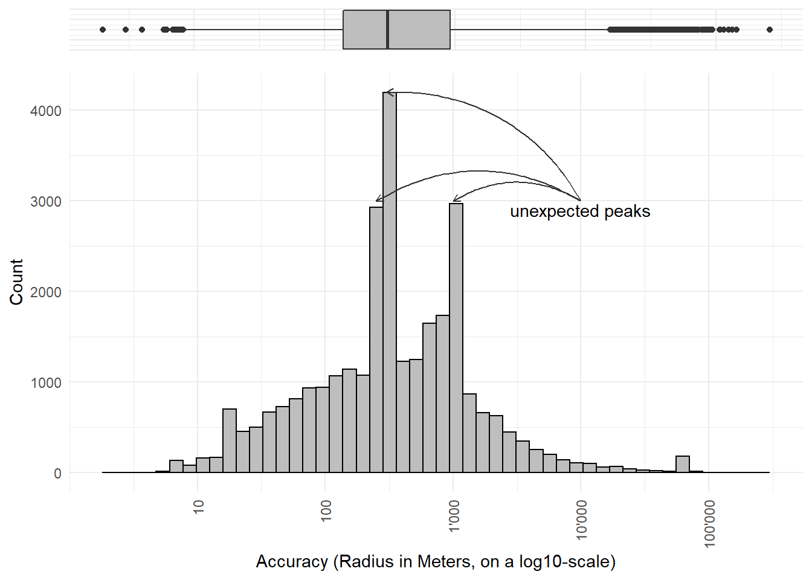
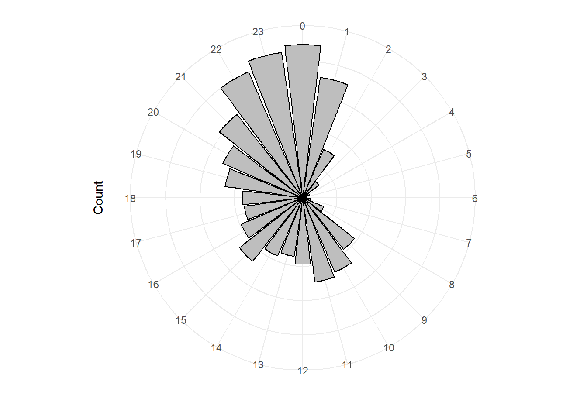

# OpenGeoHub 2023 DataChallenge

A proposal für the *OpenGeoHub Summerschool 2023* Data Challenge

## Abstract

The tick prevention app "tick" is a mobile application that provides information on tick prevention and tick bite risk. The user is able to enter tick bites in a diary and is reminded to check for possible disease symptoms. Additionally, the user can enter the location of the tick bite on a map, thus helping to identify tick hotspots. More information can be found [here](https://www.zhaw.ch/en/lsfm/business-services/natural-resource-sciences/ticks/tick-app/?mdrv=www.zhaw.ch&cHash=a51a3a438004a34df53e9a544e4b070b).

In this manner, over 50k tick bites were collected over a period of several years. This data can be used to identify tick hotspots and to predict tick bite risk based on environmental factors. We have a list of variables that experts think are important for predicting tick bite risk. We want to use machine learning to find out which variables are actually important and to predict tick bite risk for a given location. 

## Tick prevention with your smartphone

The tick-app consists of a warning and an information section, showing the correct procedure to follow after a tick bite. The warning function displays the current tick-risk in an area. The dynamic warnings uses the five-stage tick bite risk scale to indicate the tick risk during outdoor activities. The information section shows you how to protect yourself from ticks.

An entry in the tick diary allows the app to automatically remind the user to check the location on their body of the tick bite for possible disease symptoms. If there is suspicion of a tick-borne disease, users are recommended to seek a doctor's advice.

The app "tick" is available  for free for iOS- and Android-smartphones and -tablets.

